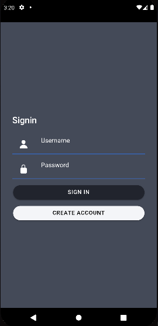
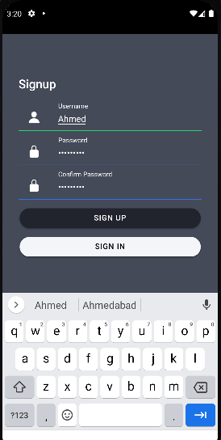
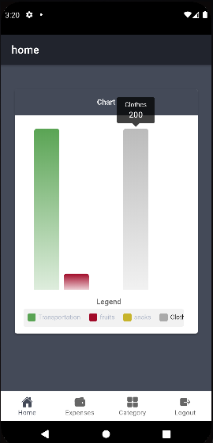
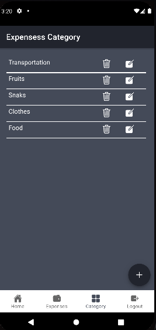
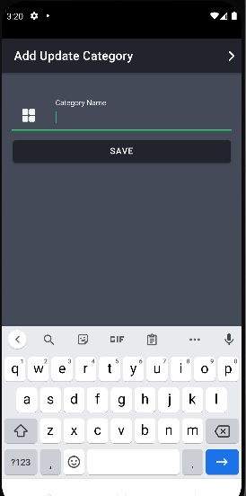
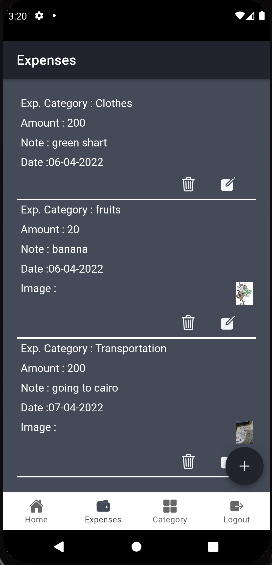
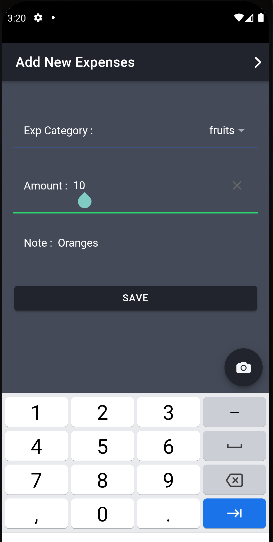

# Expensses Frontend 
this is mobile application allows you to record your expenses while arranging them in certain categories and also displaying a report on them and this is the part of the front end and it was built using Ionic , Capastor and Angular.

You can check this link to get the backend part https://github.com/Ahmed-Diab/ExpensesBackend.git
## Using 
- make sure you install Ionic cli 6.0.0 or later `npm install -g @ionic/cli` .
- make sure you install Angular cli 13.0.0 or later `npm install -g @angular/cli` .
- clone frontend `git clone https://github.com/Ahmed-Diab/ExpensesFrontend.git` .
- `cd ExpensesFrontend && npm install --save` .
- `ionic serve` .
- checkout your `http://localhost:8100` .
- clone backend `git clone https://github.com/Ahmed-Diab/ExpensesBackend.git` .

## Images

